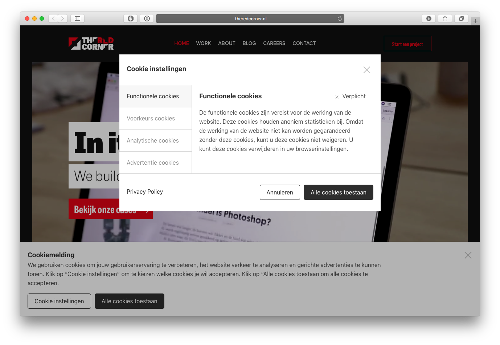

# chocolatechip.js
🍪 Universeel, disclaimer vrij en volledig open-source | AVG Cookiemelding met een strak aanpasbaar ontwerp voor Google Tag Manager

**Deze module is voor jou ontwikkeld door [The Red Corner - In it to win it.](https://theredcorner.nl)**

## Voorbeeld



## Introductie

Vanaf 25 mei 2018 veranderd de europese wetgeving omtrent privacy. Dit heeft ingrijpende consequenties voor bijna alle bedrijven. Een onderdeel van deze nieuwe wetgeving is het vereisen van een heldere cookiewall. Om dit onderdeel wat te vergemakkelijken presenteren wij hierbij chocolatechip.js.

Een volledig open-source plug & play cookiewall die wordt geïntegreerd met Google Tag Manager. Geen disclaimer, geen onverwachte backlinks, gewoon een cookiewall die er goed uit ziet en jouw leven een stukje makkelijker maakt. **Nieuw:** Vanaf nu voeg je gemakkelijk jouw cookie lijsten in. Maak een CSV met de [volgende opmaak](https://docs.google.com/spreadsheets/d/1U5ZqnbEnjFA1wj1d_ScN6NHMcUgy4QooAjDLQl2cIRA/edit?usp=sharing), en met 1 regel code staat je sheet gekoppeld.

[Bekijk de demo](https://sjorssnoeren.github.io/chocolatechip.js/)

*Let op: Om volledig te voldoen aan de AVG of GDPR moeten meer acties ondernomen worden. Wij geven nooit garantie over het daadwerkelijk voldoen aan de gestelde eisen, gebruik is volledig op eigen risico. Snel hulp nodig met het implementeren van de nieuwe wetgeving binnen jouw organisatie? [Stuur ons een mail](mailto:mail@theredcorner.nl)*

## Installatie

#### Stap 1: Voeg chocolatechip.js toe

Voeg het volgende script toe voor het sluiten van met van `<body>` tag. Dit kan in de pagina zelf of met behulp van Google TagManager.

```html
<script src="https://gitcdn.link/repo/sjorssnoeren/chocolatechip.js/develop-v2/dist/js/chocolatechip.js"></script>
<script>
  ChocolateChip.eat({
    includes: ['userPreferences', 'analytics', 'advertisements'],
    privacyPolicyURL: 'http://example.com/privacy-policy',
  });
</script>
```

#### Stap 2: Voeg de triggers toe in Google Tag Manager

Maak een nieuwe aangepaste trigger aan in Google Tag Manager. In onderstaande tabel vind je de verschillende waarden die je kunt gebruiken. Bij het laden van het script en bij het aanpassen van een voorkeur worden de juiste events in het Tag Manager dataLayer geschoten.

| Waarde | Titel | Beschrijving |
|--------|-------|--------------|
| ChocolateChip_functional | Functionele Cookies | Vereist voor juiste werking van de website.  |
| ChocolateChip_userPreferences | Voorkeurs Cookies | Wordt gebruikt voor het aanpassen van voorkeur van de gebruiker. |
| ChocolateChip_analytics | Analytische Cookies | Voor analyse doeleinden om de website te verbeteren. |
| ChocolateChip_advertisements | Advertentie Cookies | Om bij te houden welke advertenties een gebruik heeft gezien, en hoe vaak. |

#### Stap 3: Koppel jouw CSV met cookies

Vanaf heden is het ook mogelijk een CSV te gebruiken om de verschillende cookies uit te lichten. Een voorbeeld van deze CSV vind je [hier](https://docs.google.com/spreadsheets/d/1U5ZqnbEnjFA1wj1d_ScN6NHMcUgy4QooAjDLQl2cIRA/edit?usp=sharing). Je koppelt eenvoudig de cookie lijst door de URL van een CSV in te voegen met de optie `cookiesSheetURL`. Dit kun je bij een google docs document doen door de URL te kopieëren, het woord `/edit` aan het einde van de URL te vervangen met `/export?format=csv`.

Bekijk onderstaand voorbeeld hoe dit er in zijn totaliteit uit ziet:

```html
<script src="https://gitcdn.link/repo/sjorssnoeren/chocolatechip.js/develop-v2/dist/js/chocolatechip.js"></script>
<script>
  ChocolateChip.eat({
    includes: ['userPreferences', 'analytics', 'advertisements'],
    privacyPolicyURL: 'http://example.com/privacy-policy',
    cookiesSheetURL: 'https://docs.google.com/spreadsheets/d/1U5ZqnbEnjFA1wj1d_ScN6NHMcUgy4QooAjDLQl2cIRA/export?format=csv'
  });
</script>
```

De CSV wordt ingeladen en deze wordt netjes in een opgemaakte tabel getoond. In de kolom *category* gebruik je de een van de volgende waarden: `functional`, `userPreferences`, `analytics` of `advertisements`. Om de tabel te kunnen zien, moet de categorie natuurlijk zijn benoemd in het script onder de key: `includes`.

## Extra opties
| Key | Beschrijving | Type | Voorbeeld |
|-----|--------------|------|-----------|
| `language` | Geeft de taal van de banner aan. Mocht deze taal niet in de vertalingen staan wordt `nl_NL` aangehouden.| String | `nl_NL`, `en_GB` |
| `translations` | Wordt gebruikt om de huidige standaard `en_NL` en `en_GB` vertalingen te overschrijven en om nieuwe talen toe te voegen, die vervolgens via `language` aangeroepen kunnen worden. De keys hiervoor zijn te vinden in `lib/defaultTranslations.js`. | Object | zie beschrijving onder deze tabel |
| `bannerLayout` | Kan worden gebruikt om de cookie banner bovenaan de pagina te tonen | String | `bottom` (standaard), `top` |
| `disableAcceptThroughInteraction` | Standaard wordt elke klik op de pagina geregistreerd als consent. Met de nieuwe wetgeving is het sterk aangeraden de standaard optie te overschrijven. Wanneer deze optie true is zal de gebruiken enkel nog met actieve consent de cookies accepteren | Boolean | `true` / `false` |
| `preferencesDefaultChecked` | Maakt het mogelijk om alle verschillende voorkeuren standaard aan te vinken. Wanneer een gebruiker de voorkeuren wil aanpassen krijgt hij nog de mogelijkheid om deze uit te zetten. Let op: dit is niet geoorloofd door de nieuwe AVG/GDPR wetgeving. | Boolean | `true` / `false` |

### Aanpassen taalbestand

Met de onderstaande opties zou de standaard nederlandse vertaling getoond worden. Echter mocht `language` bijvoorbeeld `fr_FR` zijn, dan wordt de franse vertaling getoond, waar in dit geval alleen `'bannerTemplate.actionSluiten'` naar het frans vertaald zal zijn.

```
ChocolateChip.eat({
    ...
    language: 'nl_NL',
    translations: {
    	fr_FR: {
    		'bannerTemplate.actionSluiten': 'Fermer',
    	}
    },
  });
```

## Roadmap

* Responsive design improvements
* Customizable SASS variabelen
* Landingspage
* Uitgebreidere documentatie

## Licentie

Dit project is gelicenseerd onder MIT. Raadpleeg het LICENSE bestand voor meer informatie.
